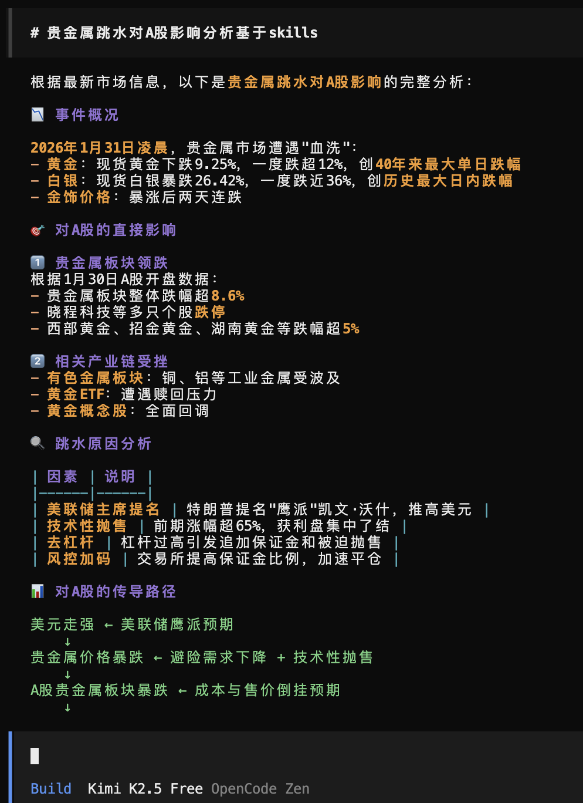
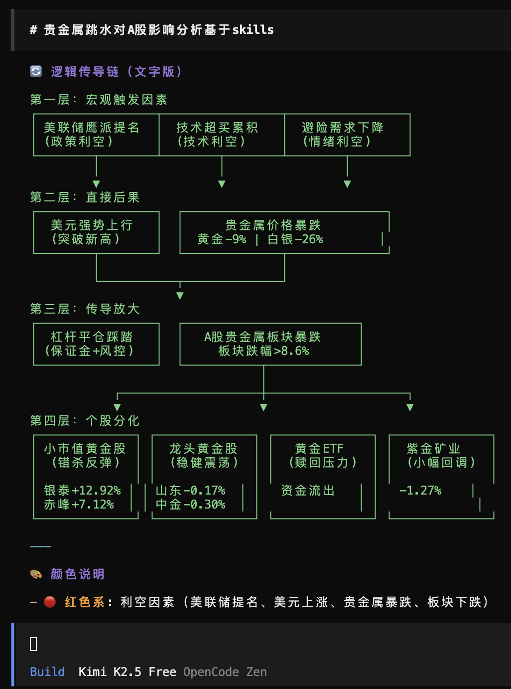
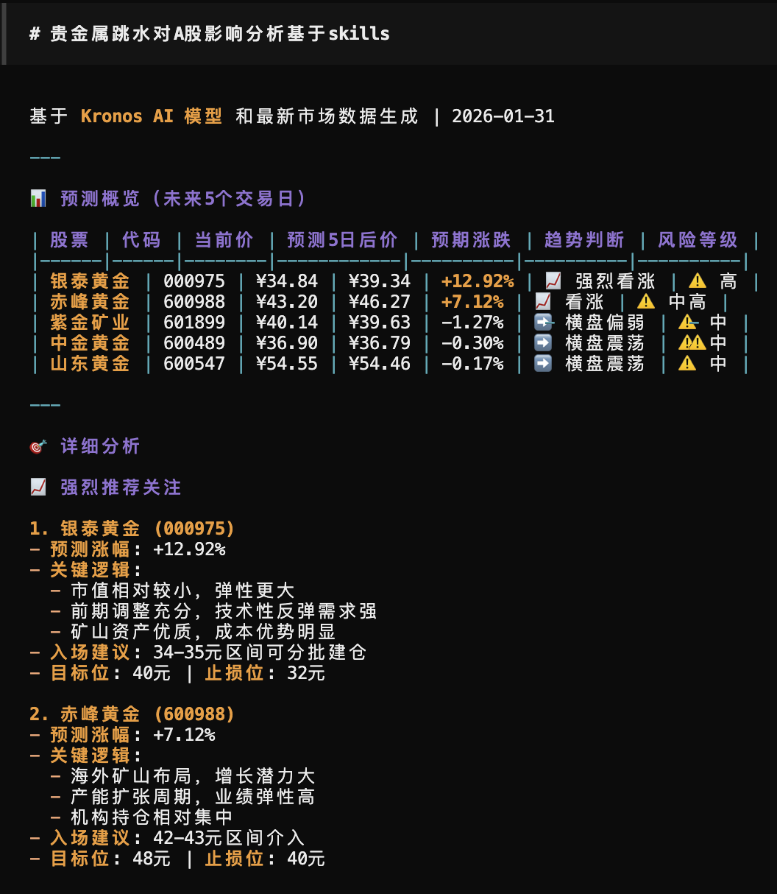

# 🧠 Awesome Finance Skills

> **Transform your AI agent into a Wall Street analyst in seconds.**
>
> A plug-and-play skill collection that empowers LLMs with **real-time news**, **stock data**, **sentiment analysis**, **logic visualization**, and **market prediction** capabilities.
>
> 🚀 **New:** DeepEar Live Demo (Free Lite Version) is now online: [https://deepear.vercel.app/](https://deepear.vercel.app/)

[English](#english) | [中文](#中文)

---

<a name="english"></a>
## 🇬🇧 English

### ✨ Highlights

| 📰 Real-time News & Trends | 📊 Logic Chain Visualization | 🔮 AI-Powered Prediction |
|:---:|:---:|:---:|
|  |  |  |
| Aggregate hot news from 10+ sources (Cailian, WSJ, Weibo, Polymarket...) | Auto-generate transmission chain diagrams explaining market impact | Kronos model forecasts with news-aware adjustments |

### 🚀 Quick Start

#### Option 1: One-Step Install (Recommended)
You can now install individual skills directly using `npx skills`:

```bash
# Install a specific skill (e.g., alphaear-news)
npx skills add RKiding/Awesome-finance-skills@alphaear-news

# Or search for all the skills and then select one
npx skills find "alphaear"
```

#### Option 2: Manual Installation
```bash
# Clone the repository
git clone https://github.com/RKiding/Awesome-finance-skills.git

# Copy skills to your agent (example for OpenCode)
cp -r Awesome-finance-skills/skills/* ~/.config/opencode/skills/
```

**That's it!** Your agent now understands finance. Try asking:

> *"分析贵金属跳水对A股的影响"*  
> *"Analyze how the gold crash affects A-shares"*

🔗 **Live Demo**: [See it in action →](https://opncd.ai/share/wOp37QIs)

---

### 📦 Included Skills

| Skill | Description | Key Feature |
|:------|:------------|:------------|
| **alphaear-news** | Real-time financial news & trends | 10+ sources, Polymarket data |
| **alphaear-stock** | A-Share & HK stock data | Ticker search, OHLCV history |
| **alphaear-sentiment** | FinBERT / LLM sentiment analysis | Score: -1.0 ~ +1.0 |
| **alphaear-predictor** | Kronos time-series forecasting | News-aware adjustments |
| **alphaear-signal-tracker** | Investment signal evolution | Strengthen / Weaken / Falsify |
| **alphaear-logic-visualizer** | Transmission chain diagrams | Draw.io XML output |
| **alphaear-reporter** | Professional report generation | Plan → Write → Edit → Chart |
| **alphaear-search** | Web search & local RAG | Jina / DDG / Baidu |

---

### 🔧 Integration Guide

**Awesome Finance Skills** supports multiple agent frameworks:

| Framework | Scope | Installation Path |
|:----------|:------|:------------------|
| **Antigravity** | Workspace | `<workspace>/.agent/skills/<skill>/` |
| | Global | `~/.gemini/antigravity/global_skills/<skill>/` |
| **OpenCode** | Project | `.opencode/skills/<skill>/` or `.claude/skills/<skill>/` |
| | Global | `~/.config/opencode/skills/<skill>/` |
| **OpenClaw** | Workspace | `<workspace>/skills` (highest priority) |
| | Managed | `~/.openclaw/skills` |
| **Claude Code / Codex** | Personal | `~/.claude/skills/` or `~/.codex/skills/` |
| | Project | `.claude/skills/` |

> 💡 Each skill folder must contain a `SKILL.md` file.

---

### 🔗 Related Project

For a **complete autonomous financial analysis framework**, check out:

**[DeepEar →](https://github.com/RKiding/AlphaEar)**

---

<a name="中文"></a>
## 🇨🇳 中文

> 🚀 **全新:** DeepEar 在线演示 (免费Lite版) 现已上线: [https://deepear.vercel.app/](https://deepear.vercel.app/)

### ✨ 核心亮点

| 📰 实时新闻聚合 | 📊 逻辑链路可视化 | 🔮 AI 智能预测 |
|:---:|:---:|:---:|
|  |  |  |
| 聚合财联社、华尔街见闻、微博、Polymarket 等 10+ 信源 | 自动生成传导链路图，直观解释市场影响 | 基于 Kronos 模型的时序预测，结合新闻情绪调整 |

### 🚀 快速开始

#### 方式一：一键安装（推荐）
现在你可以使用 `npx skills` 直接安装单个技能：

```bash
# 安装指定技能（如：alphaear-news）
npx skills add RKiding/Awesome-finance-skills@alphaear-news

# 或者搜索更多金融技能
npx skills find "get the finance news (alphaear-news)"
```

#### 方式二：手动安装
```bash
# 克隆仓库
git clone https://github.com/RKiding/Awesome-finance-skills.git

# 复制技能到你的 Agent（以 OpenCode 为例）
cp -r Awesome-finance-skills/skills/* ~/.config/opencode/skills/
```

**搞定！** 你的 Agent 现在已经拥有金融分析能力。试试问它：

> *"分析贵金属跳水对A股的影响"*

🔗 **在线演示**: [查看实战效果 →](https://opncd.ai/share/wOp37QIs)

---

### 📦 技能清单

| 技能 | 功能描述 | 核心特性 |
|:-----|:---------|:---------|
| **alphaear-news** | 实时财经新闻与热点趋势 | 10+ 信源，Polymarket 数据 |
| **alphaear-stock** | A股/港股行情数据 | 股票搜索、OHLCV 历史数据 |
| **alphaear-sentiment** | FinBERT / LLM 情感分析 | 评分范围: -1.0 ~ +1.0 |
| **alphaear-predictor** | Kronos 时序预测模型 | 结合新闻情绪动态调整 |
| **alphaear-signal-tracker** | 投资信号演化追踪 | 强化 / 弱化 / 证伪 |
| **alphaear-logic-visualizer** | 传导链路图生成 | 输出 Draw.io XML |
| **alphaear-reporter** | 专业研报生成 | 规划 → 撰写 → 编辑 → 图表 |
| **alphaear-search** | 全网搜索与本地 RAG | 支持 Jina / DDG / 百度 |

---

### 🔧 技能接入指南

**Awesome Finance Skills** 支持多种主流 Agent 框架：

| 框架 | 作用域 | 安装路径 |
|:-----|:-------|:---------|
| **Antigravity** | 工作区 | `<workspace>/.agent/skills/<skill>/` |
| | 全局 | `~/.gemini/antigravity/global_skills/<skill>/` |
| **OpenCode** | 项目 | `.opencode/skills/<skill>/` 或 `.claude/skills/<skill>/` |
| | 全局 | `~/.config/opencode/skills/<skill>/` |
| **OpenClaw** | 工作区 | `<workspace>/skills`（优先级最高） |
| | 托管 | `~/.openclaw/skills` |
| **Claude Code / Codex** | 个人 | `~/.claude/skills/` 或 `~/.codex/skills/` |
| | 项目 | `.claude/skills/` |

> 💡 每个技能文件夹需包含 `SKILL.md` 文件。

---

### 🔗 完整框架

如需**完整的自动化金融分析框架**，请关注：

**[DeepEar →](https://github.com/RKiding/AlphaEar)**

---

## 🌟 Star History

[](https://star-history.com/#RKiding/Awesome-finance-skills&Date)
