# 系统总览图

更新时间：2026-03-26

## 一图看懂

```mermaid
flowchart TD
    U["你（对话 / 交易口述 / 偶发截图校准）"]
    M["Codex 主协作入口"]

    subgraph S1["状态层"]
      SM["state-manifest.json\n续跑入口"]
      RAW["snapshots/latest_raw.json\n原始平台快照"]
      LG["ledger/execution_ledger.json\n执行流水"]
      PS["state/portfolio_state.json\n当前策略主状态"]
      LS["latest.json\n兼容视图"]
      AC["account_context.json\n总资产/现金口径"]
      RD["risk_dashboard.json\n风险仪表盘"]
    end

    subgraph S2["规则层"]
      IPS["INVESTMENT_POLICY_STATEMENT.md\n投资政策声明"]
      DT["DECISION_TREE.md\n交易决策树"]
      HY["hypotheses.md\n市场假设追踪"]
      BT["bucket-targets-and-mapping-v2.md\n六类仓位目标与映射"]
    end

    subgraph S3["记录层"]
      JR["journal/daily/YYYY-MM-DD.md\n日度纪要"]
      TX["transactions/*.json\n交易流水"]
      TC["trade_cards/YYYY/*.md\n重要交易卡片"]
      SC["scorecards/weekly/*.md\n周度评分"]
    end

    subgraph S4["市场与基金数据层"]
      MM["market-mcp\n股票/基金统一数据源"]
      MB["market_briefs/YYYY-MM-DD-market.md\n市场日报"]
      DB["daily_briefs/YYYY-MM-DD-brief.md\n组合日报"]
      FW["fund-watchlist.json\n基金观察名单"]
      FP["funds 插件同步\nChrome 实时基金面板"]
    end

    subgraph S5["自动化层"]
      A1["Portfolio Market Brief"]
      A2["Portfolio Daily Brief"]
      A3["Portfolio Risk Alert"]
      A4["Portfolio Weekly Score"]
      A5["Funds Plugin Sync"]
    end

    subgraph S6["输出层"]
      O1["盘前计划 / 午间观察"]
      O2["收盘复盘 / 次日计划"]
      O3["周度复盘"]
      O4["长期可追溯档案"]
    end

    U --> M
    M --> SM
    SM --> PS
    SM --> RAW
    SM --> LG
    SM --> JR
    SM --> MB
    SM --> SC

    M --> IPS
    M --> DT
    M --> HY
    M --> BT

    M --> TX
    M --> JR
    M --> TC

    M --> MM
    MM --> MB
    MM --> DB
    MM --> FW
    FW --> FP

    A1 --> MB
    A2 --> DB
    A3 --> RD
    A4 --> SC
    A5 --> FP

    RAW --> PS
    LG --> PS
    PS --> LS
    PS --> RD
    AC --> RD
    IPS --> RD
    JR --> O4
    TC --> O4
    MB --> O1
    DB --> O2
    SC --> O3
```

## 模块说明

### 1. 输入层

- 你日常主要通过`对话`告诉系统买卖、转换、到账、情绪和判断
- `截图`现在不是每日必需，只在总资产、现金或多笔交易混乱时用于校准
- 系统默认以`基金交易`为主；短线非基金交易允许存在，但属于例外层，不改变主骨架
- 基金主骨架默认在`开盘前计划`、`14:30-15:00确认`、`收盘后复盘`这三个窗口运转

### 2. 状态层

- [state-manifest.json](/Users/yinshiwei/codex/tz/portfolio/state-manifest.json)
  负责告诉新会话“先读哪些文件”
- [latest_raw.json](/Users/yinshiwei/codex/tz/portfolio/snapshots/latest_raw.json)
  保留平台/插件的原始快照，不直接承载策略修正
- [execution_ledger.json](/Users/yinshiwei/codex/tz/portfolio/ledger/execution_ledger.json)
  保留确认交易、待确认申购和卖出回笼等执行流水
- [portfolio_state.json](/Users/yinshiwei/codex/tz/portfolio/state/portfolio_state.json)
  是当前持仓与账户状态的主文件
- [latest.json](/Users/yinshiwei/codex/tz/portfolio/latest.json)
  是给旧脚本和旧面板保留的兼容视图
- [account_context.json](/Users/yinshiwei/codex/tz/portfolio/account_context.json)
  存放总资产、现金等工作口径
- [risk_dashboard.json](/Users/yinshiwei/codex/tz/portfolio/risk_dashboard.json)
  把集中度、港股高波、成长科技等风险量化

### 3. 规则层

- [INVESTMENT_POLICY_STATEMENT.md](/Users/yinshiwei/codex/tz/portfolio/INVESTMENT_POLICY_STATEMENT.md)
  是最高优先级规则文件
- [DECISION_TREE.md](/Users/yinshiwei/codex/tz/portfolio/DECISION_TREE.md)
  把盘前、收盘后和情绪场景变成条件判断
- [hypotheses.md](/Users/yinshiwei/codex/tz/portfolio/hypotheses.md)
  跟踪“你到底在赌什么”
- [2026-03-26-bucket-targets-and-mapping-v2.md](/Users/yinshiwei/codex/tz/portfolio/reports/2026-03-26-bucket-targets-and-mapping-v2.md)
  把六类仓位从概念落到金额

### 4. 记录层

- 日度纪要：重要聊天、市场判断、执行结论都会写回
- 交易流水：口头确认和平台确认的交易记录
- 交易卡片：结构变化较大的交易会单独留卡
- 周度评分：从纪律、集中度、执行一致性角度打分

### 5. 数据层

- [market-mcp](/Users/yinshiwei/codex/tz/market-mcp)
  整合了 `go-stock` 与 `funds`
- 现在已经支持：
  - A 股、港股、美股指数
  - CME 官方延时报价的 `ES/NQ`
  - 上金所 `Au99.99`
  - 基金实时估值与观察名单
- Chrome `funds` 插件已经能同步你的基金列表

### 6. 自动化层

当前自动化的职责：

- 每个交易日晚间生成市场日报
- 每个交易日晚间生成组合日报
- 检查风险是否超限
- 每周出纪律评分
- 每天同步基金插件

### 7. 输出层

你最终看到的主要是四种结果：

- 盘前计划 / 午间观察 / 尾盘确认
- 收盘复盘 / 明日操作预案
- 周度复盘
- 长期可追溯的档案沉淀

## 日常使用顺序

1. 你告诉我今天发生了什么
2. 我先更新原始快照或执行流水，再物化主状态
3. 系统重算风险和仓位结构
4. 结合市场数据给出盘前计划、尾盘确认或收盘后计划
5. 自动化在收盘后补齐日报、风险提醒和插件同步

## 当前最重要的系统原则

1. 先按“仓位桶”讨论，再按“基金/板块”讨论
2. 先补防守仓和核心仓，再考虑港股参与仓和战术仓
3. 短线非基金交易可以做，但不能挤占基金主骨架
4. 先记录和复盘，再追求更复杂的预测
