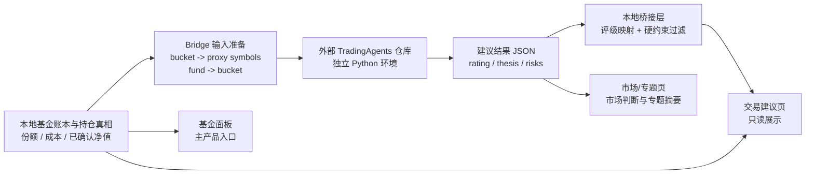

# Simplified Fund OS + TradingAgents Bridge Design

## Goal

把当前系统从“自建大而全基金经理工作台 + 自研交易分析链”的方向，收敛回一个可长期维护的简化产品：

> 本地保留基金账本与持仓真相，交易分析尽量外包给外部成熟框架。

这次设计的核心不是再做一轮 UI 微调，而是做一次明确的产品和架构收缩：

- 基金面板回到主产品地位
- 交易分析从“本地重型主脑”改为“外部建议层”
- 保留账本、净值、收益、持仓、执行记录这些你真正需要长期可信的底座
- 把复杂的因子融合、shadow、promotion、研究治理降级成 legacy，不再作为主线继续扩建

## Why This Direction Is Reasonable

这次回撤不是“白做了”，而是一次很正常的架构止损。

当前系统已经出现了几个对个人维护非常不友好的特征：

- 产品层过重：工作台、市场首页、交易页、Research 页、兼容页并行推进，维护面太大
- 真相链复杂：`portfolio_decision_cycle`、`strategy_decision_contract`、`agent_runtime_context`、`trade_plan_v4`、`macro_radar` 之间存在 freshness / ownership / fallback 问题
- 研究链过长：factor fusion、shadow、promotion gate、research profiles 形成了完整研究平台，但这对当前实际需求明显过度
- UI 层被上游复杂度反向拖累：页面一直在解释 stale、fallback、limited，而不是只服务日常基金管理
- 维护成本不成比例：你真正想要的是“基金面板 + 可靠收益 + 简洁交易建议”，而不是维护一套大型量化研究平台

所以这次收缩的判断是合理的：

- **不是否定已有底座价值**，而是把重心重新放回最有复用价值的部分
- **不是放弃交易分析**，而是把交易分析从自研主链改成成熟外部系统的建议输入
- **不是推翻一切**，而是把能沉淀的底层保留下来，把让系统变臃肿的那一层降级掉

## Product Positioning

新系统的定位固定为：

> 一个面向场外基金管理的“基金操作系统”，外接一个 TradingAgents 建议层。

它不再是“基金经理工作台 + 自研交易研究平台”的合体。

它的职责边界应该非常清楚：

### 本地系统负责什么

本地系统继续负责“真相层”和“执行记录层”：

- 基金持仓账本
- 份额、成本、已确认净值链
- QDII / 场外确认时滞处理
- 持有收益、估值收益、待生效收益拆分
- 手工转换、申购、赎回记录
- 基金展示面板
- 最终基金级别的建议展示与人工确认

### TradingAgents 负责什么

TradingAgents 只负责“建议层”和“市场判断层”：

- 市场环境判断
- 板块/主题/事件分析
- 股票或 ETF 代理层面的买入/增配/持有/减配/卖出建议
- 风险辩论与组合建议输出

### 本地桥接层负责什么

桥接层只做最薄的一层映射，不承担主脑职责：

- bucket / fund -> proxy symbols 映射
- TradingAgents 评级 -> 基金建议语言映射
- 最基本的硬约束过滤
- 输出只读 JSON 供面板展示

## What We Keep

这次简化后，下面这些是明确保留的核心资产：

### 1. 基金账本与持仓真相

保留并继续作为主线的包括：

- `/Users/yinshiwei/codex/tz/portfolio/scripts/record_manual_fund_trades.mjs`
- `/Users/yinshiwei/codex/tz/portfolio/scripts/reconcile_confirmed_nav.mjs`
- `/Users/yinshiwei/codex/tz/portfolio/scripts/refresh_account_sidecars.mjs`
- `/Users/yinshiwei/codex/tz/portfolio/scripts/lib/holding_cost_basis.mjs`
- `/Users/yinshiwei/codex/tz/portfolio/scripts/lib/confirmed_nav_reconciler.mjs`
- `/Users/yinshiwei/codex/tz/portfolio/scripts/lib/portfolio_state_materializer.mjs`
- `/Users/yinshiwei/codex/tz/portfolio/scripts/lib/fund_confirmation_policy.mjs`

这些是整个系统最值得保留的部分，因为它们直接决定：

- 你的份额是否准确
- 你的成本是否准确
- 你的收益是否能和基金软件对上
- 你的 QDII / 场外确认时滞是否被正确处理

### 2. 原始基金面板风格

基金面板应重新回到主入口地位。

产品上要恢复成：

- 展示优先
- 分析为辅
- 高密度基金列表优先
- 收益、确认状态、净值时效一眼可扫
- 少一点“系统解释”，多一点“终端感”

### 3. 最小必要的交易约束与执行记录

即使把交易分析外包，下面这些本地能力仍然必要：

- fund-only 范围约束
- bucket 边界约束
- 禁止把外部建议直接变成真实订单
- 人工确认后再形成基金级操作记录
- 所有真实动作仍由本地账本落地

## What We Demote To Legacy

以下能力不建议继续作为主线演进，但也不立即删除：

### 1. 重型交易决策主链

先整体降级为 legacy / fallback：

- `/Users/yinshiwei/codex/tz/portfolio/scripts/run_portfolio_decision_cycle.mjs`
- `/Users/yinshiwei/codex/tz/portfolio/scripts/generate_next_trade_plan.mjs`
- `/Users/yinshiwei/codex/tz/portfolio/scripts/build_strategy_decision_contract.mjs`
- `/Users/yinshiwei/codex/tz/portfolio/scripts/build_agent_runtime_context.mjs`
- `/Users/yinshiwei/codex/tz/portfolio/scripts/generate_dialogue_analysis_contract.mjs`

这些能力可以保留代码和历史产物，但不再作为新系统的主入口。

### 2. Factor fusion / shadow / promotion 研究体系

建议整体移出主产品叙事，保留为独立研究遗产：

- `factor_fusion_engine.py`
- `backtest_fusion_engine.py`
- `run_factor_fusion_shadow_cycle.mjs`
- `generate_factor_fusion_shadow_review.mjs`
- `generate_factor_fusion_shadow_rollup.mjs`
- `generate_research_shadow_track_report.mjs`
- 各类 `research_profiles`
- promotion gate / rollup / action convergence / bucket stability 体系

这些不是“错”，而是对你当前单账户、基金为主、强调可维护性的场景来说太重了。

### 3. 当前重型 workbench 渲染链

下列 workbench 链建议不再继续作为主产品中心扩建：

- `workbench_payload`
- `workbench_view_model`
- `workbench_page`
- `workbench_sections`
- 首页 / 市场 / Research 多层仪表台

它们可以保留为历史分支或 legacy 入口，但不应该继续承载主产品方向。

## Target Product Shape

新主产品固定为三个一级页面：

1. `基金面板`
2. `交易建议`
3. `市场/专题`

### 1. 基金面板

这是默认首页，也是最重要的页面。

它的职责非常单纯：

- 看当前持仓
- 看收益
- 看确认状态
- 看净值/估值时效
- 看分桶和总资产概览
- 看哪些基金存在“当前不宜直接和基金软件比较”的结构化原因

这个页面的定位不是“分析台”，而是“可信的基金持仓终端”。

### 2. 交易建议

交易建议页只承接外部建议，不承担执行主脑。

固定展示：

- TradingAgents 最新输出时间
- bucket 级建议
- fund 级映射建议
- 建议强度与理由摘要
- 本地约束过滤结果
- 明确区分：
  - 原始外部建议
  - 经过本地桥接后的基金建议
  - 被本地约束拦掉的建议

不展示：

- 自动生成真实订单
- 自动写回交易账本
- 重型 trade plan 语义

### 3. 市场/专题

这个页面用来承接：

- 市场主判断摘要
- 板块与主题强弱
- 关键金融事件
- 专题分析
- 外部建议系统给出的主要市场观点

它不是一个实时盘中终端，而是一个轻量级市场阅读页。

## TradingAgents Integration Strategy

### Decision

TradingAgents 采用 **外部仓库 + 外部 Python 环境 + 本地 JSON bridge** 的方式接入。

不做：

- vendoring 到当前 repo
- 作为本地 live execution engine
- 直接改写本地 canonical 交易产物

### Why External Bridge Is Better

这样做有几个明显好处：

- 降低当前 repo 复杂度
- 减少 Python / LLM 依赖污染
- TradingAgents 可以单独升级或替换
- 失败时不会污染本地账本与面板真相
- 未来若你改用别的建议引擎，本地只需要替换桥接层

## Integration Architecture



## Phase 1 Bridge Scope

第一阶段只接三个主动风险桶：

- `A_CORE`
- `GLB_MOM`
- `TACTICAL`

### HEDGE

`HEDGE` 第一阶段只做软参考，不做强动作建议主桶。

原因：

- HEDGE 容易被外部股票/ETF 建议引擎误判成常规配置机会
- 你的真实需求更偏基金配置保护，不是频繁交易的 alpha 桶
- 先让它作为风险提示和参考更稳妥

### INCOME / CASH

第一阶段不让 `INCOME` 和 `CASH` 成为主动进攻建议目标。

原因：

- `CASH` 在你当前口径里是合并桶：现金 + 债券 + 低波防守承载桶
- `INCOME` 和 `CASH` 主要是承接、缓冲、防守
- 外部建议引擎更适合给“进攻和轮动”方向的建议，不适合直接主导你的防守资金配置

## Rating Mapping

TradingAgents 的输出建议映射到本地基金建议语言时，第一版固定采用：

- `BUY` -> `增配`
- `OVERWEIGHT` -> `偏增配`
- `HOLD` -> `维持`
- `UNDERWEIGHT` -> `减配`
- `SELL` -> `显著减配 / 退出候选`

同时保留两个附加字段：

- `confidence`
- `reasonSummary`

这样页面不会只显示一个动作词，而是能看到：

- 建议方向
- 建议强弱
- 建议原因

## Minimal Local Guardrails

外部建议进入本地页面前，至少做以下约束：

### 1. fund-only guard

外部建议必须先映射成现有基金 universe 内的建议；如果映射不到基金，就只显示为 bucket 观察，不生成基金动作建议。

### 2. non-executable guard

外部建议只允许进入只读建议页，不能直接落成本地订单或真实交易记录。

### 3. bucket bounds guard

若某 bucket 已明显超上限或低于下限，本地桥接层要在展示上给出“受本地约束影响”的标记。

### 4. stale suggestion guard

如果 TradingAgents 输出时间过旧，页面必须标记 `stale suggestion`，而不是当日建议。

### 5. missing market input guard

如果外部建议生成时缺关键输入，本地页面只能显示“观察结论”，不得伪装成高置信交易建议。

## Data Contracts

第一阶段建议新增一个极薄的数据桥接契约，例如：

### External raw output

```json
{
  "asOf": "2026-04-24T09:30:00+08:00",
  "engine": "TradingAgents",
  "universe": ["QQQ", "KWEB", "SOXX"],
  "calls": [
    {
      "symbol": "QQQ",
      "rating": "OVERWEIGHT",
      "confidence": 0.72,
      "thesis": "US large-cap growth leadership persists",
      "risks": ["macro rate repricing", "AI capex sentiment reversal"]
    }
  ]
}
```

### Local bridged output

```json
{
  "asOf": "2026-04-24T09:45:00+08:00",
  "source": "TradingAgents",
  "bucketSuggestions": [
    {
      "bucket": "GLB_MOM",
      "verdict": "偏增配",
      "confidence": 0.72,
      "reasonSummary": "美股成长主线仍强，但需防利率扰动",
      "proxySymbols": ["QQQ", "SOXX"],
      "guardrailStatus": "advisory_only"
    }
  ],
  "fundSuggestions": [
    {
      "fundCode": "xxxxxx",
      "bucket": "GLB_MOM",
      "verdict": "偏增配",
      "reasonSummary": "映射自 QQQ / SOXX 建议",
      "guardrailStatus": "needs_manual_confirmation"
    }
  ]
}
```

## Page Semantics

### 基金面板

语义固定为：

- 真实持仓页
- 真实收益页
- 真实确认状态页

不混入：

- 长篇市场分析
- research 证据墙
- 自动交易计划

### 交易建议

语义固定为：

- 外部建议输入页
- 本地约束过滤页
- 人工判断辅助页

不混入：

- 本地自动执行主链
- 复杂 shadow / promotion 诊断

### 市场/专题

语义固定为：

- 市场观察页
- 板块与主题专题页
- 金融事件摘要页

不需要承载：

- 复杂系统状态
- 工程后台解释
- 多层 freshness / fallback 说明墙

## Migration Strategy

### 1. 保守迁移，不在当前脏分支上硬回滚

当前分支和工作区已经积累了大量变更，不适合直接“在原地删改直到变简单”。

建议固定采用：

- 当前 `codex/kakushadze-signal-mapping` 作为历史备份保留
- 从 `main` 拉一份干净 worktree
- 在干净工作树上重建简化版

### 2. 旧能力先 freeze，再决定是否删除

对当前重型链路，先做：

- 停止继续扩展
- 标成 legacy
- 退出主路由和主叙事

而不是第一天就大规模删除。

这样好处是：

- 可回看旧逻辑
- 可迁移底层有价值的代码
- 避免误删仍有用的账本和净值处理能力

## Non-Goals

本轮明确不做：

- 不继续打造自研大型量化交易框架
- 不把 TradingAgents 变成真实交易执行器
- 不把 TradingAgents vendoring 进当前仓库
- 不让外部建议直接写回基金账本
- 不继续把 shadow / promotion / factor fusion 作为主产品卖点
- 不再把首页做成多页签重型工作台

## Success Criteria

如果这次重构方向正确，最终应该达到下面几个结果：

### 产品层

- 打开系统先看到的是熟悉、可信、可扫读的基金面板
- 交易建议页清楚告诉你“外部系统建议什么、本地允许什么、你还需要人工判断什么”
- 市场/专题页足够轻，不再像后台模块堆叠

### 架构层

- 本地 repo 不再承担大型交易研究平台职责
- TradingAgents 可以独立运行、独立失败、独立升级
- 本地与外部系统通过薄 JSON 合同解耦

### 维护层

- 日常维护重心回到账本、净值、收益、持仓准确性
- UI 维护范围明显缩小
- 后续如果想替换 TradingAgents，不需要推倒本地系统

## Recommendation

建议接下来按下面顺序执行：

1. 写实施计划，锁定阶段与文件边界
2. 新建基于 `main` 的干净 worktree
3. 恢复基金面板为默认入口
4. 把当前重型交易/Research 链冻结成 legacy
5. 单独克隆并安装 TradingAgents
6. 做本地最薄桥接 JSON
7. 只做一个最小的 `交易建议` 页验证闭环

这样我们会非常稳，也更符合你现在“简化再简化”的目标。
